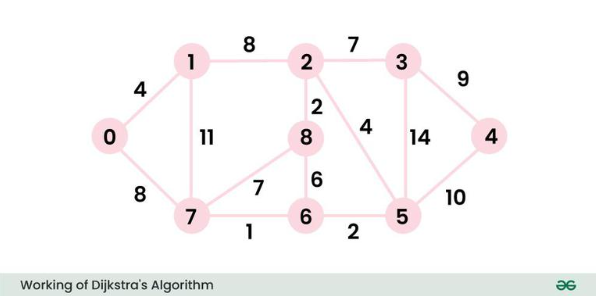
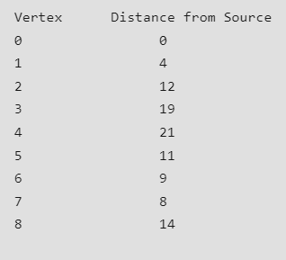
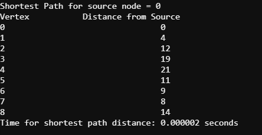
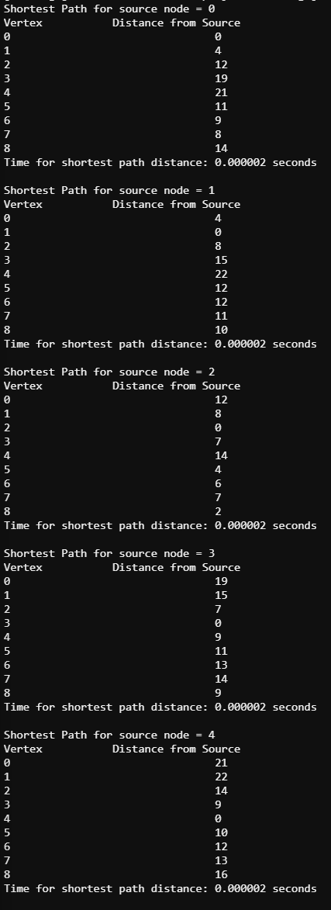
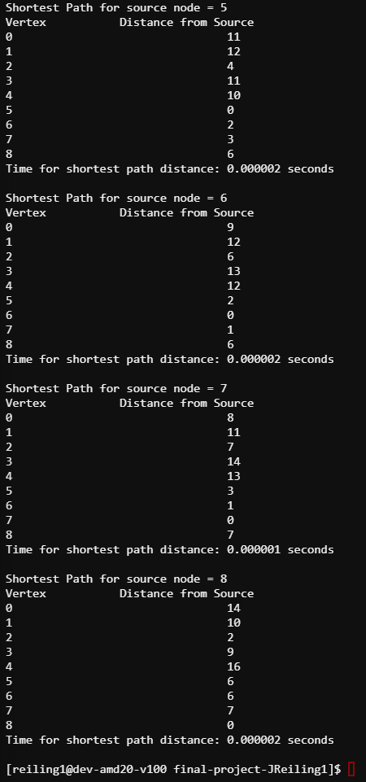
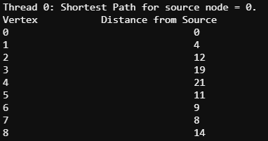
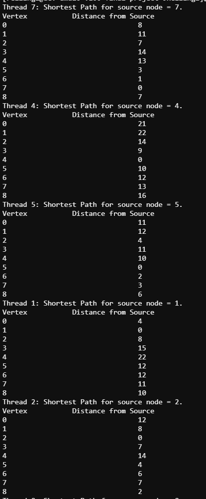
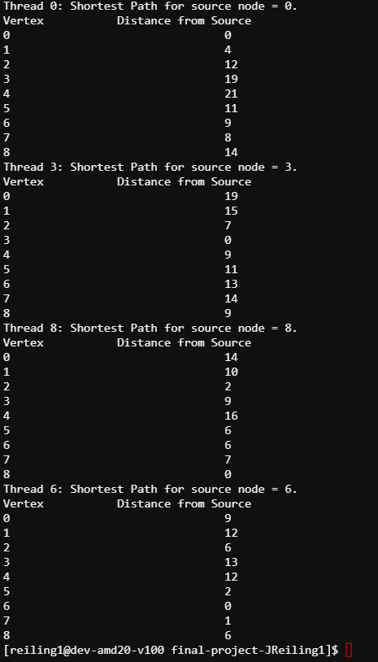
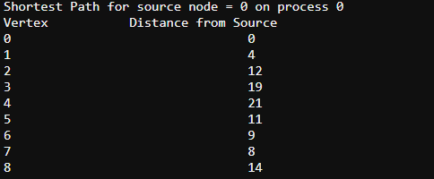

# CMSE 822: Parallel Computing Final Project

## Verification

For verification, the parallel and serial programs developed in this project were validated by comparing their results to the results of other serial implementations of Dijkstra's algorithm using a common graph. Below is an example graph used to validate the developed parallel algorithms.  

Common Graph for Validation

Below is the result of finding the shortest path in the graph above from GeeksforGeeks

Below is the result of finding the shortest path in the graph above in Jared's serial implementation

Below is the output for finding the shortest path in the graph when each node is a source node in serial

To verify with the serial implementation, here is Jared's openMP implementation with 2 threads when the source node equals 0

Below is the output for finding the shortest path in the graph when each node is a source node using openMP

To verify with the serial implementation, here is Jared's MPI implementation with 4 ranks when the source node equals 0

Below is the output for finding the shortest path in the graph when each node is a source node using MPI. Note that
this version is only printing the output when the process number equals 0.

.png)