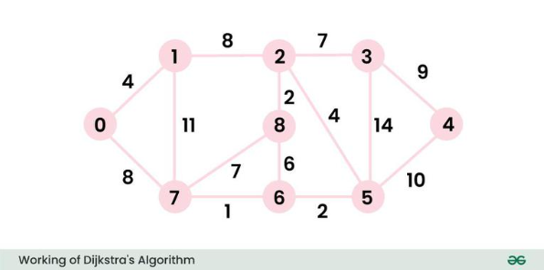
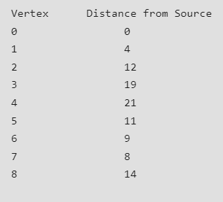
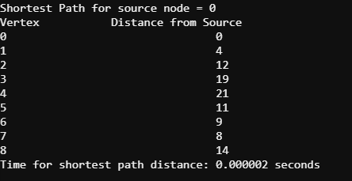
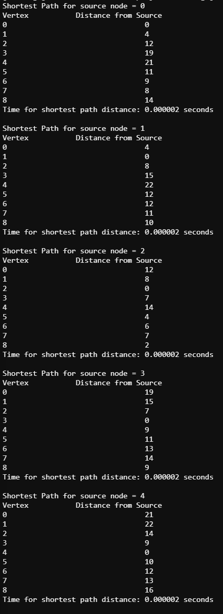
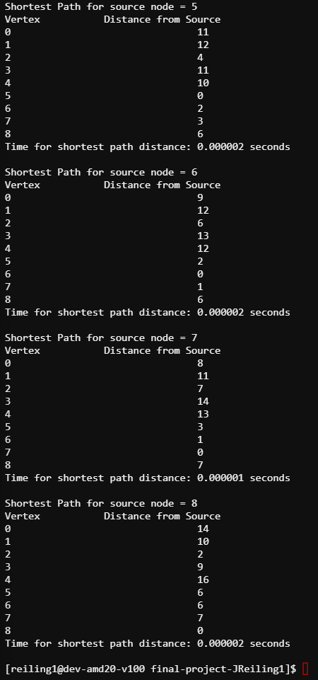
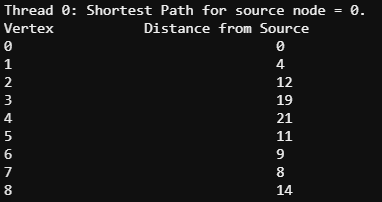
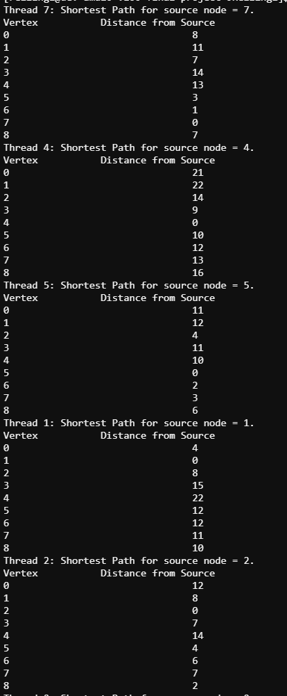
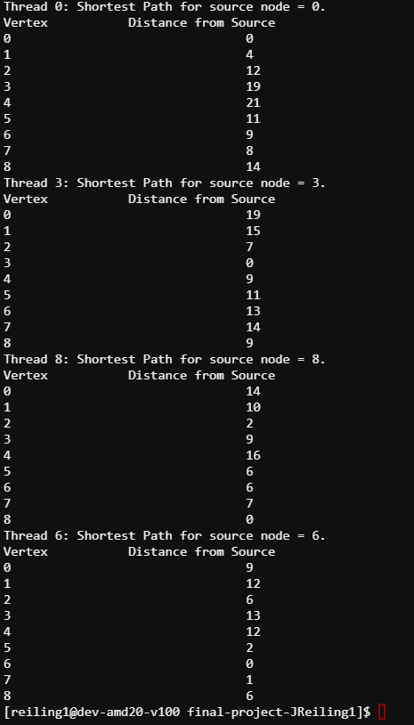
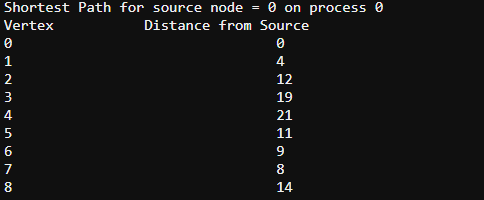

CMSE 822: Parallel Computing Final Project: Parallization of Dijkstra's Shortest Path Algorithm
==========

Jared Reiling  
==========

Department of Computational Mathematics, Science, and Engineering  
Michigan State University
-------------

## Introduction

Finding the shortest path in a graph is a necessary alorithm that is implemented thoughtout many fields of computational sciences. Applications (such as neuroscience, topological data analysis, and supply-chain management[1]) demand a way to understand how to travel from one node on a graph to another and know the shortest path. Since finding calculating the shortest path is an increasingly relevent computation for finding neuronal functional connectivity and tracking brain states, this project parallelizes a well known algorithm (Dijkstra's algorithm) to gain foundational knowledge of a necessary algorithm and adapt for parallization.   

Dijkstra's algorithm calculates the shortest path between nodes in a weighted graph [2]. It was developed by Edsger W. Dijkstra, a computer scientist, in 1956. In this implementation, this algorithm is calculating the shortest path between two nodes. The algoirthm first assignes a "source" node and calculates the shortest path to all nodes in the graph from the source node. The result is a tree that represents the shortest path to nodes in the graph. In this project, the shortest path is calulated for each node when assigned as the source.  

The algorithm works by first initializing an array storing the shortest path tree and a second array storing the shortest distance from the source ndoe to all other nodes [3]. These initialized arrays are first empty. In this implementation, a for loop iterates through the number of verticies and assigns an index as the current source. Then, all the verticies, excluding the source, have all their distances be infinite. The source node is assigned zero for its shortest distance so the algorithm will choose the source first [3].  

While the shortest path tree array does not include all the verticies, an adjacent vertex is choosen that is not in the shortest path three array and the adjacent vertex has the minimum distance to the source node. The adjacent vertex is then appended to the shortest path tree array and updates the neighboring verticies to the adjacent vertex. This updating is done by interating through all the neighboring verticies to the adjacent vertex and calculates the distance from the adjacent vertex to the neighboring verticies and saves the shortest distance value [3]. 

In this paper, we discuss the implementation of Dijkstra's algorithm in serial and in parallel. For the parallel implementaitons, we used openMP and MPI and compared the results. These programs were first compared with a graph where we know definitvly the shortest path (see verification). We then executed our programs with randomized graphs of various sizes and with varying number of threads and ranks. The main goal of this project is to compare the runtimes of caluclating Dijkstra's algorithm with parallel implementations of openMP and MPI.

## Methods

To gain familiarity with Dijksta's algorithm, we studied sources [2] and [3] to gain a conceptual and implementation understanding of the serial algorithm. Our first goal was to successfuly develop a serial verion of this algorithm that correctly performs Dijkstra's algoritm. To verify that the serial verion of the program was working, we compared to a graph provided in source [3].

By using this source, we knew that the shortest path tree array would be the following [3].

Therefore, we used this knowledge as validation for future parallization applications.  

Using this example, we developed a correct serial implementation of Dijkstra's algoithm and timed the algorithm's runtime. Upon varification, we then added a for loop that iterates through every node and assigns the node as the source and calculates the shortest path. After verification, we then decided to make randomized sized graphs to test the scability of this program.  

In this serial application , the following functions are used:
- int minDistance(int shortest_dist[], bool short_path_tree[]): A supplementary function that calculates the shortest distance and updates the shortest distance if the vertex is not in the shortest path tree and has a shorter distance than the minimum
- void printSolution(int dist[]): A supplementary function that prints the resulting distance array
- int** generateGraph(): A function that generates a random graph based on the number of verticies as specified in the global variable "num_verticies". This function uses the seed 123 to make sure that the weights of the graph are consistent when running this program multiple times. 
- int main(): The main function intializes the graph, intialized the output file for storing all the runtime information and calculates Dijkstra's algorithm. After calculating the shortest path for every node in the graph as the source node, the main function then writes the number of verticies and runtime information to a csv file and saves the information.   
For more information, please see the code in dijstra_serial.c  

In the MPI implementation, many of the supplementary functions is similar to the serial implementation above. We use MPI to distribute the workload by domain decomposition. First, we initialize MPI in the main function in create the output file. We then broadcast that the output file was createds so every process knows not to rewrite the header. Then, we initialize the graph (either the hard-coded version for verification or the randomized graph). Before starting Dijkstra's algorithm, an MPI_Barrier is used to initialize the total_start_time which syncs the start time with all the processes. We use MPI to divide the verticies equally among all the processies. For each rank, we calculate the starting vertex (int start_vertex = rank * num_verticies / size) and the ending vertex (int end_vertex = (rank + 1) * num_verticies / size). IN this implementation, every rank will have independent calculations of the shortest path algorithm. Instead of iterating through the entire list of verticies, the MPI inplementation uses the loop (for (int source_index = start_vertex; source_index < end_vertex; source_index++)) for Dijkstra's algorithm calculations. Finally, if the rank is zero, then the total_end_time is recorded and saved to the output file. 

In the openMP implementation, there are many similarities between the serial and MPI versions with key differences. In the supplementary function "printSolution", a #pragma omp critical is used for IO implementation. For print statements to be properly aligned, the omp critical statement is necessary for proper recording of the runtime as the number of threads and verticies is changing. Before iterating through each vertex, nested parallelism is disabled. This is due to the race conditions that may occur when updating the shortest distance array and shortest path tree array. A key difference in the openMP implementation compared to the MPI implemenation is that the workload is handled dynamically between the number of threads. OpenMP is automatically allocating which thread is excuting segments of code. Additionally, when the shortest distance array and shortest path tree arrays are updated, there is an omp critical statement. This is because we need to protect 

## Results

## Conclusions

## Verification

For verification, the parallel and serial programs developed in this project were validated by comparing their results to the results of other serial implementations of Dijkstra's algorithm using a common graph. Below is an example graph used to validate the developed parallel algorithms.  

Common Graph for Validation

Below is the result of finding the shortest path in the graph above from GeeksforGeeks

Below is the result of finding the shortest path in the graph above in Jared's serial implementation

Below is the output for finding the shortest path in the graph when each node is a source node in serial

To verify with the serial implementation, here is Jared's openMP implementation with 2 threads when the source node equals 0

Below is the output for finding the shortest path in the graph when each node is a source node using openMP

To verify with the serial implementation, here is Jared's MPI implementation with 4 ranks when the source node equals 0

Below is the output for finding the shortest path in the graph when each node is a source node using MPI. Note that
this version is only printing the output when the process number equals 0.

.png)

## References
1. Mengsen Zhang, Samir Chowdhury, Manish Saggar; Temporal Mapper: Transition networks in simulated and real neural dynamics. Network Neuroscience 2023; 7 (2): 431–460. doi: https://doi.org/10.1162/netn_a_00301
2. "Dijkstra's algorithm." wikipedia. Wikimedia Foundation, 20 April 2024,
https://en.wikipedia.org/wiki/Dijkstra's_algorithm
3. https://www.geeksforgeeks.org/dijkstras-shortest-path-algorithm-greedy-algo-7/