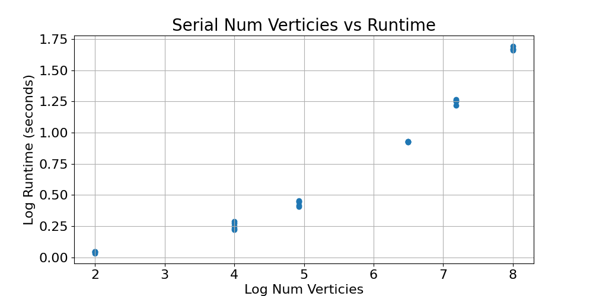
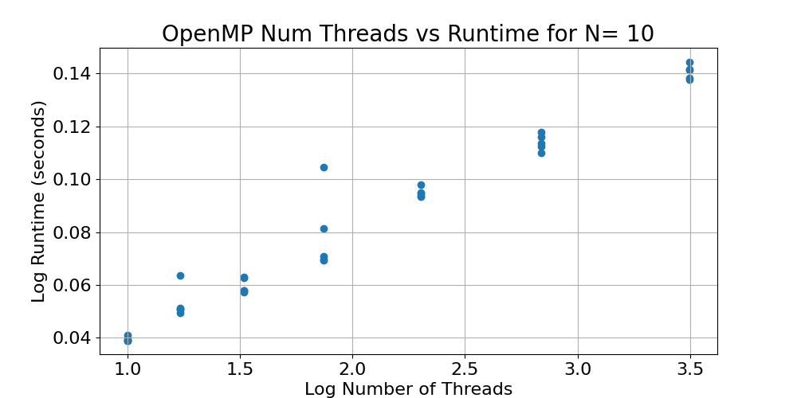
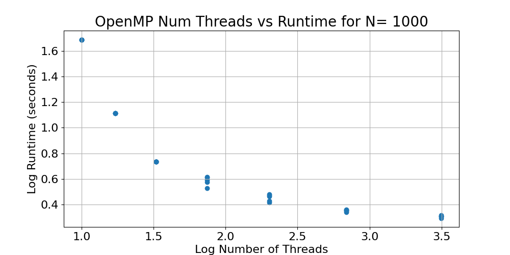
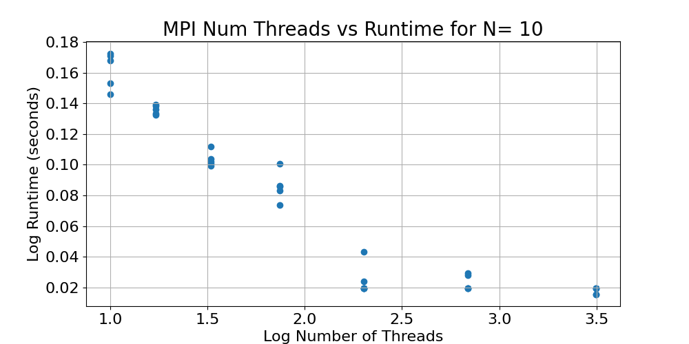
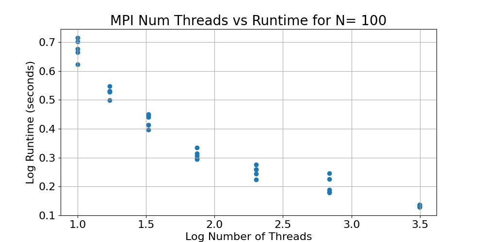

CMSE 822: Parallel Computing Final Project: Parallization of Dijkstra's Shortest Path Algorithm
==========

Jared Reiling  
==========

Department of Computational Mathematics, Science, and Engineering  
Michigan State University
-------------

## Introduction

Finding the shortest path in a graph is a necessary algorithm that is implemented thought out many fields of computational sciences. Applications (such as neuroscience, topological data analysis, and supply-chain management [1]) demand graph traversal understand and know the shortest path. This project parallelizes a well-known algorithm (Dijkstra's algorithm) to gain foundational knowledge of a necessary algorithm and adapt for parallelization.   

Dijkstra's algorithm calculates the shortest path between nodes in a weighted graph [2]. It was developed by Edsger W. Dijkstra, a computer scientist, in 1956 [2]. In this implementation, this algorithm calculates the shortest path between two nodes. The algorithm first assigns a "source" node and calculates the shortest path to all nodes in the graph from the source node. The result is a tree that represents the shortest path to nodes in the graph. In this project, the shortest path is calculated for each node when assigned as the source.  

The algorithm works by first initializing an array storing the shortest path tree and a second array storing the shortest distance from the source node to all other nodes [3]. These initialized arrays are first empty. In this implementation, a for loop iterates through the number of vertices and assigns an index as the current source. Then, all the vertices, excluding the source, have all their distances be infinite. The source node is assigned zero for its shortest distance so the algorithm will choose the source first [3].  

While the shortest path tree array does not include all the vertices, an adjacent vertex is chosen that is not in the shortest path tree array and the adjacent vertex has the minimum distance to the source node. The adjacent vertex is then appended to the shortest path tree array and updates the neighboring vertices to the adjacent vertex. This updating is done by iterating through all the neighboring vertices to the adjacent vertex and calculates the distance from the adjacent vertex to the neighboring vertices and saves the shortest distance value [3]. The time complexity of this algorithm, in serial, is O(V^2) where V is the number of nodes [2].

In this paper, we discuss the implementation of Dijkstra's algorithm in serial and in parallel. For the parallel implementations, we used OpenMP and MPI and compared the results. These programs were first compared with a graph where we definitively know the shortest path (see verification). We then executed our programs with randomized graphs of various sizes and with varying number of threads and ranks. The main goal of this project is to compare the runtimes of calculating Dijkstra's algorithm with parallel implementations of OpenMP and MPI.
 

## Methods

To gain familiarity with Dijksta's algorithm, we studied sources [2] and [3] to gain a conceptual and implementation understanding of the serial algorithm. Our first goal was to successfully develop a serial version of this algorithm that correctly performs Dijkstra's algorism. To verify that the serial version of the program was working, we compared to a graph provided in source [3].

By using this source, we knew that the shortest path tree array would be the following [3].

Therefore, we used this knowledge as validation for future parallelization applications.  

Using this example, we developed a correct serial implementation of Dijkstra's algorithm and timed the algorithm's runtime. Upon verification, we then added a for loop that iterates through every node and assigns the node as the source and calculates the shortest path. After verification, we then decided to make randomized sized graphs to test the stability of this program.  

In this serial application , the following functions are used:
- int minDistance(int shortest_dist[], bool short_path_tree[]): A supplementary function that calculates the shortest distance and updates the shortest distance if the vertex is not in the shortest path tree and has a shorter distance than the minimum.
- void printSolution(int dist[]): A supplementary function that prints the resulting distance array.
- int** generateGraph(): A function that generates a random graph based on the number of vertices as specified in the global variable "num_verticies". This function uses the seed 123 to make sure that the weights of the graph are consistent when running this program multiple times. 
- int main(): The main function initializes the graph, initialized the output file for storing all the runtime information and calculates Dijkstra's algorithm. After calculating the shortest path for every node in the graph as the source node, the main function then writes the number of vertices and runtime information to a csv file and saves the information.   
For more information, please see the code in dijstra_serial.c  

In the MPI implementation, many of the supplementary functions are similar to the serial implementation above. We use MPI to distribute the workload by domain decomposition. First, we initialize MPI in the main function and create the output file. We then broadcast that the output file so every process knows not to rewrite the header. Then, we initialize the graph (either the hard-coded version for verification or the randomized graph). Before starting Dijkstra's algorithm, an MPI_Barrier is used to initialize the total_start_time which syncs the start time with all the processes. We use MPI to divide the vertices equally among all the processes. For each rank, we calculate the starting vertex (int start_vertex = rank * num_verticies / size) and the ending vertex (int end_vertex = (rank + 1) * num_verticies / size). In this implementation, every rank will have independent calculations of the shortest path algorithm. Instead of iterating through the entire list of vertices, the MPI implementation uses the loop (for (int source_index = start_vertex; source_index < end_vertex; source_index++)) for Dijkstra's algorithm calculations. Finally, if the rank is zero, then the total_end_time is recorded and saved to the output file.  

In the openMP implementation, there are many similarities between the serial and MPI versions with key differences. In the supplementary function "printSolution", a #pragma omp critical is used for IO implementation. For print statements to be properly aligned, the omp critical statement is necessary for proper recording of the runtime as the number of threads and vertices is changing. Before iterating through each vertex, nested parallelism is disabled. This is due to the race conditions that may occur when updating the shortest distance array and shortest path tree array. Like the MPI implementation, the OpenMP version includes domain decomposition and allocating threads to specific sections of the graph to calculate the shortest distance. That way, the work is distributed between all of the threads evenly and gives the program speedup.

## Verification
Before we starting scaling the number of nodes in the graph, we wanted to verify that the output produced by Dijkstra's algorithm using OpenMP and MPI were producing the correct result. 
For verification, the parallel and serial programs developed in this project were validated by comparing their results to the results of other serial implementations of Dijkstra's algorithm using a common graph [3]. Below is an example graph used to validate the developed parallel algorithms.  

Common Graph for Validation

Below is the result of finding the shortest path in the graph above from [3]

Below is the result of finding the shortest path in the graph above in our serial implementation

Below is the output for finding the shortest path in the graph when each node is a source node in serial

To verify with the serial implementation, here is our OpenMP implementation with 2 threads when the source node equals 0

Below is the output for finding the shortest path in the graph when each node is a source node using OpenMP

To verify with the serial implementation, here is our MPI implementation with 4 ranks when the source node equals 0

Below is the output for finding the shortest path in the graph when each node is a source node using MPI. Note that
this version is only printing the output when the process number equals 0.

.png)

As shown here, the parallel implementations of OpenMP and MPI using varying thread counts and ranks produce the same result. Therefore, we can scale the size of the graph without needing to verify the correct shortest path tree since it was verified in this simple example. 

## Results

We first calculate the total run time for the serial implementation of Dijkstra's algorithm and plot against the number of vertices of the graph. We determined that the run time scales exponentially with the number of vertices in the graph. Notice this implementation is exactly what we expected since the time complexity of this algorithm is O(V^2) where V is the number of nodes in the graph [2].

Second, we implemented OpenMP as described in the methods section. This implementing involves discretizing the domain of nodes to be processed such that each thread has a balanced load. As expected, the overall run time decreases as the number of threads increases. The speedup is most demonstrated when the graph has 100 nodes and 1000 nodes. For the graph implementation of 10 nodes, the overall run time increases since it takes the HPCC more time to instantiate and run the program threaded when compared to only running this program on one thread

The explanation for the outliers on these plots can be due to jitter on the HPCC. Since each thread is "fighting" for resources, there will be runs where other jobs running will cause the latency to increase. 

Thirdly, we implemented MPI as described in the methods section. This implementation also involved discretizing the domain of nodes where the threads are balancing the computational load. As expected, as the number of threads increase, the overall runtime decreases This is due to each thread having the same load and processing the same amount of information compared to other MPI threads. 

Additionally notice that for both MPI and OpenMP when the number vertices equals 100 and 1000, the run time decreases exponentially. Since the time complexity of the serial version is O(V^2), as we add more threads in powers of 2, the overall runtime will then decrease.

## Conclusions

The overall goal of this project was to implement and understand how Dijkstra's algorithm performed in serial and in parallel. In our exploration, we implemented parallelism, OpenMP and MPI, and compared their results to each other and the serial implementation. First, we used existing literature to construct a serial implementation, verified the correct shortest path calculation, and then parallelized the algorithm. To verify that the parallelization was producing the correct result, we changed the number of ranks and nodes in the OpenMP and MPI implementation to determine if the algorithms were working correctly in parallel. After verification, we then used a random graph generator that generate a random graph with a given number of nodes and a seed to maintain random consistency across trials. We observed that as the number of nodes increased and the number of threads increased, the overall run time decreased. However, for a graph of size 10, the number of threads/ranks caused the algorithm to run longer. Therefore, we conclude that for graphs with 100 and 1000 nodes, MPI and OpenMP parallelization decreases the runtime exponentially as observed in the results above. Both parallelization methods are comparable to each other in terms of performance and provide a significant speedup as the number of threads and ranks increase.  

In conclusion, we want to explain that we demonstrated the requirements of this project:
- Two different parallel programming models: For this section, we implemented MPI (distributed memory) and OpenMP (shared memory). We implemented these parallelization strategies separately so we could determine their efficacy to each other and to the serial implementation of Dijkstra's algorithm.  
- Parallelization Strategies: we adopted two different parallelization strategies (distributed and shared memory). In both adaptations, we used domain decomposition to determine the workload for each thread; however, the implementation of OpenMP and MPI were different. OpenMP created a parallel environment in which all the threads had access to the same graph yet the shortest path tree and shortest distance arrays were kept private in each thread to prevent race conditions and overwriting of calculations from another thread. MPI also created a parallel region in which each thread was assigned a segment of the graph to traverse and each thread had a separate copy of the shortest path tree and the shortest distance array. Since distributed memory is default for MPI, this parallelization strategy works well for this application since shared memory can cause overwriting to both arrays.  
- Verification test: Before using a randomly generated graph, we compared the performance of the serial, OpenMP, and MPI implementations of Dijkstra's algorithm to a common graph used in each instance. By changing the number of ranks/threads for OpenMP and MPI, we were able to determine that the shortest path calculation was correct when using different number of threads.  
- Load balancing: In both parallel instances, OpenMP and MPI, the work for each thread is evenly distributed. Previously, the workload for the OpenMP implementation was not balanced which caused no speedup as the number of threads increased. Therefore, the load of each thread was almost identical to produce the optimal runtime. 
- Memory usage: For the MPI implementation, each graph was stored as a copy in each thread which does increase the amount of memory needed to run this calculation. However, the distributed memory did affect the overall performance. When compared to the OpenMP implementation, OpenMP performed with larger node graphs because all the threads in OpenMP were accessing the same graph which prevented the need for duplication across each thread. For smaller graph sizes, such as 10 or 100 nodes, the graph duplication time across all nodes does not significantly affect the runtime when comparing OpenMP and MPI. 
- Scaling Studies: In this project, we increased the number of nodes in a randomly generated graph and measured the runtime in applications using serial, OpenMP, and MPI parallelism. As we increased the number of nodes in the graph, we increased the number of threads used in the calculations to determine the speedup.

## Future Directions

As a future project, we would like to implement this parallelization method in real-world data. Since there are many neuroscience applications with measuring brain states and network analysis, getting a graph from real-world sources could help us find functional connectivity between different areas of the human or animal brain. We are also interested in understanding how different densities of graphs would effect the performance of our algorithms. A denser network with less nodes could perform faster than a network with more nodes but with less connections between nodes.  

Another future direction is parallelizing other shortest path algorithms to determine which algorithms perform better in various parallelization and with varying number of nodes and density. In this project, we mainly focused on Dijkstra's algorithm but many shortest path algorithms exist that may be parallelized. We leave these project suggestions as possible project topics for the next cohort of students taking CMSE 822: Parallel Computing at Michigan State University.

## References
1. Mengsen Zhang, Samir Chowdhury, Manish Saggar; Temporal Mapper: Transition networks in simulated and real neural dynamics. Network Neuroscience 2023; 7 (2): 431–460. doi: https://doi.org/10.1162/netn_a_00301
2. "Dijkstra's algorithm." wikipedia. Wikimedia Foundation, 20 April 2024,
https://en.wikipedia.org/wiki/Dijkstra's_algorithm
3. "How to find Shortest Paths from Source to all Vertices using Dijkstra’s Algorithm." geeksforgeeks, 20 April 2024, https://www.geeksforgeeks.org/dijkstras-shortest-path-algorithm-greedy-algo-7/